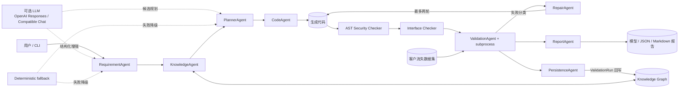
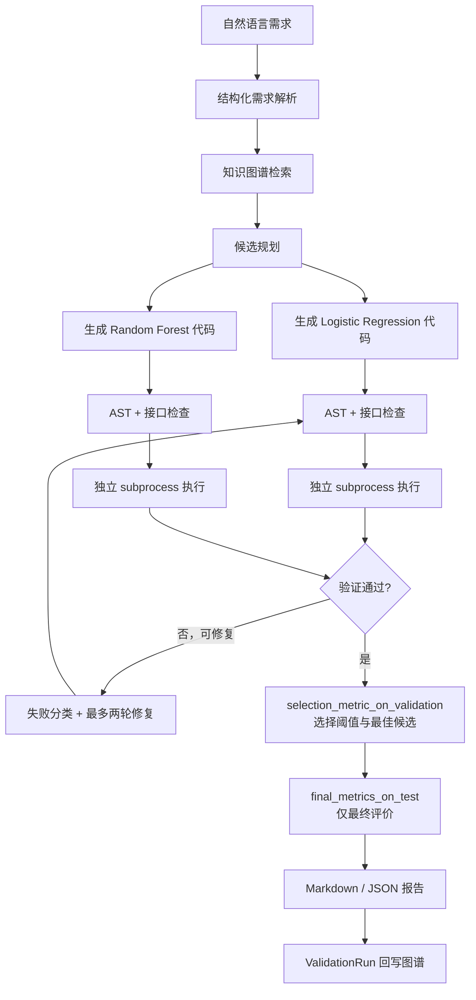
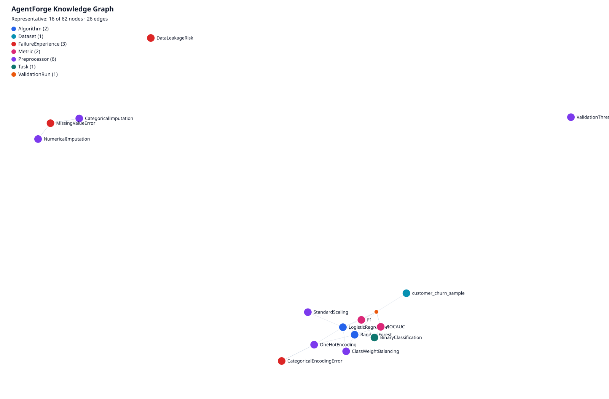

# AgentForge

> 一个将自然语言算法需求转化为可验证算法实现，并将结果沉淀回知识图谱的多 Agent 算法能力工厂原型。

AgentForge 面向客户流失表格二分类场景：它解析需求、检索行业能力知识、规划并生成两个候选实现，在隔离的 validation/test 评价流程中选择最佳候选，并输出可审计报告。默认模式完全离线、零 API 成本；LLM 是可选增强能力。

> 实现边界：默认路径采用受控模板完成可验证的半自动代码复刻；生成文件是真实独立产物，但核心训练逻辑复用可信 runtime。LLM 自由代码生成是默认关闭的可选实验能力。

## 项目亮点

- 8 个职责清晰的 Agent 通过结构化 Pydantic 状态协作。
- NetworkX 行业能力知识图谱支持可解释检索、失败经验关联和 ValidationRun 回写。
- 自动规划并独立比较 Logistic Regression 与 Random Forest。
- 默认生成可执行的确定性 Python 模板；LLM 自由代码生成是显式关闭的可选项。
- `selection_metric_on_validation` 负责候选与阈值选择，`final_metrics_on_test` 只做最终评价。
- 生成代码依次通过 Python AST、安全规则、统一接口和受控 subprocess 检查。
- 失败分类后最多执行两轮知识驱动的确定性修复；故障候选不会阻塞其他候选。
- 每次运行生成 Markdown 与 JSON 报告，并可将成功验证摘要回写知识图谱。
- 支持 `deterministic`、`hybrid`、`llm` 三种模式，以及 OpenAI Responses 和 OpenAI-compatible Chat Completions。
- OpenAI-compatible 适配器使用兼容性更广的 `system` 消息，已适配 DeepSeek 类端点。
- 无 API Key 也能完整运行安全、可复现的默认 Demo。
- 当前测试覆盖需求解析、知识检索、数据隔离、安全、执行、修复、报告、LLM 假客户端与降级路径。

> 安全边界：AST 规则与限时 subprocess 能降低意外风险，但不是容器、虚拟机或生产级安全沙箱。

## 系统架构



## 端到端工作流



Test 集不参与阈值搜索、候选排序或最低分判断；最佳候选仅由 validation 集上的主指标确定。

## Agent 职责

本项目中的 Agent 是具有独立职责、结构化输入输出、事件轨迹和失败边界的工作流组件，不等同于完全自治、自由协商的智能体群体。

| Agent | 输入 | 输出 | 职责 |
|---|---|---|---|
| RequirementAgent | 自然语言、显式覆盖 | `AlgorithmRequirement` | 解析并规范化受支持的二分类需求，记录字段来源 |
| KnowledgeAgent | 结构化需求、知识图谱 | `RetrievedKnowledge` | 检索算法、预处理、指标和失败经验并给出匹配理由 |
| PlannerAgent | 需求、检索结果 | `CandidatePlan[]` | 从受控算法注册表生成两个可执行候选计划 |
| CodeAgent | 候选计划 | `GeneratedArtifact` | 默认生成统一 `train/predict/evaluate` 确定性模板 |
| ValidationAgent | 代码、需求、执行结果 | `CandidateResult` | 校验产物、分离 validation/test 指标并提供选择依据 |
| RepairAgent | 失败类型、代码、图谱经验 | `RepairRecord`、新代码 | 对受支持错误执行最多两轮可追溯修复 |
| ReportAgent | `WorkflowState` | Markdown、JSON | 汇总需求、事件、指标、安全检查、修复和 LLM 状态 |
| PersistenceAgent | 成功工作流 | 更新后的 GraphML/JSON | 写入 ValidationRun、算法、数据集和指标关系 |

## 知识图谱

当前正式图谱包含 62 个节点和 149 条边，其中保留 4 个 ValidationRun（基准、历史失败经验和两次工作流验证）。真实节点类型为：`Task`、`Algorithm`、`Preprocessor`、`Metric`、`Constraint`、`Dataset`、`ValidationRun`、`FailureExperience`、`Dependency`、`SourceDocument`。

真实关系类型为：`SUITABLE_FOR`、`REQUIRES`、`EVALUATED_BY`、`HANDLES`、`SATISFIES`、`USED_ALGORITHM`、`PERFORMED_ON`、`FAILED_BECAUSE`、`IMPROVED_BY`、`ACHIEVED_METRIC`、`DEPENDS_ON`、`DERIVED_FROM`。

图谱参与候选约束、预处理依据补齐、失败经验检索和 ValidationRun 回写，但当前不是复杂图推理或超参数搜索系统。

- [图谱 Schema](knowledge/schema.md)
- [能力清单](knowledge/capabilities.json)
- [JSON 图谱](knowledge/knowledge_graph.json)
- [GraphML 图谱](knowledge/knowledge_graph.graphml)
- [知识图谱可视化](docs/assets/knowledge-graph.svg)
- [可视化生成脚本](scripts/visualize_knowledge_graph.py)



上图由提交的 JSON 图谱离线生成，是强调算法、关键预处理、F1/ROC-AUC、三个失败经验、数据集和一个 ValidationRun 的代表性子图，不是对全部 62 个节点的拥挤平铺。

## 三种运行模式

| 模式 | 行为 | API Key | 默认代码生成/修复 |
|---|---|---|---|
| `deterministic` | 全程使用本地解析、规划与可信模板，零 API 成本、固定随机种子 | 不需要 | 确定性模板 / 确定性规则 |
| `hybrid` | 优先调用配置的 LLM；失败时仅在显式允许后降级 | 可选 | LLM 代码生成和修复仍关闭 |
| `llm` | 要求完整 LLM 配置；缺少配置或调用失败时行为明确 | 需要 | 仍需显式开关才能启用 |

裸 `python -m agentforge.cli demo` 始终显式使用 `deterministic`，不会因为本地 `.env` 而意外产生付费请求。LLM 代码生成与 LLM 修复默认关闭；即使显式启用，生成代码也必须经过同一安全与验证链。

## 环境安装

支持 Python `>=3.11,<3.15`，已在 macOS Apple Silicon / Python 3.14 上复验。Linux 使用相同命令。

```bash
git clone https://github.com/starry-yuxin/AgentForge.git
cd AgentForge
python3 -m venv .venv
source .venv/bin/activate
python -m pip install --upgrade pip
python -m pip install -r requirements.txt
python -m pip check
```

## 3 分钟快速演示（无 Key）

```bash
# 完整确定性工作流：两个候选、验证选优、测试评价、报告输出
python -m agentforge.cli demo

# 注入真实缺失值处理故障，展示分类、图谱经验检索和确定性修复
python -m agentforge.cli demo --inject-failure missing_imputer

# 查询知识图谱
python scripts/query_knowledge.py \
  --task binary_classification \
  --metric f1 \
  --characteristic missing_values
```

自定义数据集运行：

```bash
python -m agentforge.cli run \
  --request "Build a customer churn model with Logistic Regression and Random Forest; primary metric F1." \
  --dataset data/churn_sample.csv \
  --metric f1 \
  --minimum-score 0.60 \
  --no-persist
```

## Real-world Dataset Demo / 真实公开数据复现

仓库提供一个受控适配器，可下载并验证 UCI Iranian Churn Dataset（3,150 行、
13 个特征、二分类目标、CC BY 4.0），再用现有 deterministic 工作流完成两个候选
的训练、validation 选优和 test 最终评价。真实数据及运行产物保持在 Git 忽略目录；
报告会记录来源、许可证、转换、泄漏审查和文件 SHA-256。

```bash
python scripts/prepare_uci_churn.py
python -m agentforge.cli run \
  --mode deterministic \
  --no-persist \
  --dataset data/external/uci_iranian_churn/processed/uci_iranian_churn.csv \
  --output-root outputs/uci-real-churn \
  --request "请为UCI真实电信客户流失数据比较Logistic Regression和Random Forest，以F1作为主要指标。"
```

详见 [真实数据说明、泄漏审查与复现边界](docs/real-world-data.md)。该结果只证明
公开数据上的可复现运行，不代表生产性能、业务泛化能力或部署就绪。

2026-08-24 的固定种子复验结果如下。标准分层切分存在相同特征签名跨集合，
因此其结果可能略微乐观；敏感性实验不代表生产泛化能力。`Status` 仅被视为
潜在代理字段，未被证明为目标泄漏。

| UCI 设置 | Random Forest test F1 |
|---|---:|
| 标准分层、完整特征 | 0.882353 |
| 重复组隔离 | 0.833333 |
| 重复组隔离并移除 `status` 与 `customer_value` | 0.823529 |

完整的 Logistic Regression、validation、ROC-AUC、阈值和重复组统计见
[UCI 数据可信度审计](docs/uci-data-audit.md)。模拟数据继续用于零下载、故障注入
和稳定回归；真实公开数据用于验证外部 schema 适配能力，两者用途不同。

实际 CLI 参数以以下命令为准：

```bash
python -m agentforge.cli demo --help
python -m agentforge.cli run --help
```

## 可选 LLM 配置

仅在明确希望产生真实 API 调用时，才复制 `.env.example` 并在本地填写配置。不要提交 `.env`。ChatGPT 订阅与 API 计费相互独立。

DeepSeek 使用 OpenAI-compatible Chat Completions，安全示例配置如下；Key 只保存在本地 `.env`：

仓库同时提供一份[真实需求解析的脱敏验证记录](examples/llm/README.md)。该记录只证明
RequirementAgent 曾完成一次兼容端点调用，不代表 LLM 代码生成或修复已被验证。

```dotenv
AGENTFORGE_MODE=hybrid
LLM_PROVIDER=openai
OPENAI_BASE_URL=https://api.deepseek.com
OPENAI_MODEL=deepseek-v4-flash
OPENAI_API_MODE=chat_completions
LLM_ALLOW_FALLBACK=true
LLM_ENABLE_CODE_GENERATION=false
LLM_ENABLE_CODE_REPAIR=false
```

DeepSeek HTTP/SDK连接、Chat Completions的`system`角色兼容，以及一次RequirementAgent结构化需求解析已通过真实请求验证。该证据仅验证需求理解，不代表LLM自由代码生成或LLM代码修复已经验证；外部服务和模型输出仍可能随时间变化。

```bash
# 无 Key 的受控降级演示；不会启用 LLM 代码生成或修复
python -m agentforge.cli demo --mode hybrid --allow-llm-fallback

# OpenAI Responses
python -m agentforge.cli demo --mode hybrid \
  --llm-provider openai --llm-api-mode responses --llm-model <model>

# OpenAI-compatible Chat Completions（例如兼容端点）
python -m agentforge.cli demo --mode hybrid \
  --llm-provider openai-compatible \
  --llm-api-mode chat_completions \
  --llm-model <model>
```

真实调用可能产生费用、延迟、限流和数据处理风险。API Key 使用 `SecretStr` 保存，不进入结构化配置摘要；异常信息会做密钥替换。仓库测试全部使用 fake/mock 客户端，不访问网络。

## 输出结构

每次工作流运行创建唯一目录：

```text
outputs/runs/<run-id>/
├── generated/<algorithm>/attempt-<n>/candidate.py
├── models/<algorithm>/attempt-<n>/*.pkl
├── results/<algorithm>/attempt-<n>/*.json
└── reports/
    ├── workflow_report.json
    └── workflow_report.md
```

报告同时记录事件时间线、安全检查、统一接口、subprocess 状态、validation/test 指标、修复历史、运行模式、LLM 调用与 fallback 摘要。subprocess 命令摘要使用脱敏相对名称；本地报告中的产物路径可能是当前机器的绝对路径，因此公开报告前应再做路径脱敏。

## 参考结果

默认固定种子 Demo 的当前复验结果如下。数值来自合成客户流失样例，仅用于证明流程可运行，不代表真实业务泛化能力。

| 候选 | Validation F1（用于选择） | Test F1（最终评价） | Test ROC-AUC |
|---|---:|---:|---:|
| Logistic Regression | 0.6957 | 0.6739 | 0.9145 |
| Random Forest | 0.6316 | 0.6047 | 0.8858 |

最佳候选为 Logistic Regression，选择依据是 validation F1，而不是 test 指标。

## 自动修复案例

`python -m agentforge.cli demo --inject-failure missing_imputer` 会让 Logistic Regression attempt-0 真正绕过插补并在含缺失值的数据上失败。系统将其分类为 `MissingValueError`，从图谱检索 `missing_value_error` FailureExperience 及 `IMPROVED_BY` 关系，随后在 attempt-1 恢复数值与类别插补，并重新经过 AST、接口和 subprocess 验证。查看[脱敏说明](examples/repair_case/README.md)和[真实修复 diff](examples/repair_case/repair.diff)。

## 测试与复现

当前全量离线测试为 **160 项**，所有 LLM 测试均使用 fake/mock 客户端。

```bash
python -m pytest -q
python -m agentforge.cli demo
python -m agentforge.cli demo --inject-failure missing_imputer
python scripts/visualize_knowledge_graph.py
git diff --check
```

更完整的复现步骤、验收矩阵和结果解释见 [docs/reproducibility.md](docs/reproducibility.md)，可复制请求与静态产物见 [examples/README.md](examples/README.md)，现场讲解顺序见 [docs/DEMO.md](docs/DEMO.md)。

## 安全边界

- AST 检查和 subprocess 隔离用于降低项目受约束候选代码的意外风险。
- 当前没有容器、内核、syscall、完整网络或文件系统隔离。
- subprocess 采用 `shell=False`、最小环境和超时，但仍与宿主机共享操作系统。
- 默认只执行项目自身生成的受约束模板；不建议执行任意来源的不可信代码。
- LLM 代码生成和修复默认关闭，显式启用也不能把当前机制视为生产安全保证。

## 挑战与解决方案

| 挑战 | 当前解决方案 |
|---|---|
| 防止数据泄漏 | 固定 train/validation/test 分离；预处理仅在 train 拟合 |
| validation 与 test 职责混淆 | validation 选阈值和候选，test 只做最终评价 |
| GraphML 不支持复杂属性 | list、dict、null 使用带前缀 JSON 编码并在加载时恢复 |
| 生成代码风险 | AST 阻断网络、进程、动态执行、删除和绝对路径等高风险构造 |
| 执行挂起与日志审计 | `shell=False`、最小环境、超时、stdout/stderr 截断与落盘 |
| DeepSeek 不支持 `developer` | compatible 适配器确定性转换为 `system` 并保持消息顺序 |
| LLM 返回 null 与展示名称 | null 回退可信默认值；任务、指标、算法使用显式 alias 白名单 |
| Python 版本迁移 | 声明 Python 3.11–3.14 范围并使用支持 3.14 的正式 wheel 依赖 |
| 密钥安全 | `.env` 忽略、`SecretStr`、安全摘要排除密钥、异常脱敏 |

## 项目结构

```text
agentforge/
├── agents/       # 需求、知识、规划、代码、验证、修复、报告、持久化
├── knowledge/    # 图谱存储、导入与检索
├── llm/          # provider-neutral 接口与两个 API 适配器
├── validation/   # AST、安全、接口、harness 与 subprocess
├── repair/       # 失败分类
├── models/       # 严格工作流数据契约
└── workflow/     # 编排与事件
knowledge/        # 能力数据、来源文档、GraphML/JSON
scripts/          # 数据、图谱、查询、演示和可视化脚本
tests/            # 全量离线回归测试
docs/             # 复现说明和可视化
examples/         # 脱敏请求示例
```

## 当前边界

- 仅支持表格二分类与仓库内注册的两个候选算法。
- 默认“代码生成”是受控确定性模板，不等同于任意 LLM 自由编码。
- AST 检查和 subprocess 不是生产级沙箱，不提供内核、容器、网络或系统调用隔离。
- 无 Web UI、FastAPI、云部署、SQLite、MCTS 或 Beam Search。
- 图谱与合成数据适合原型演示，不是生产数据治理或在线模型平台。
- 真实 LLM 结果依赖供应商、模型版本、配额和网络；确定性模式才是离线复现基线。

未来可以在保持白名单和验证边界的前提下扩展文本分类、异常检测、算法插件注册、API 服务与更严格的 CPU/内存/网络资源限制；这些均未在当前版本实现。

## License

本笔试原型仓库当前未声明开源许可证；如需公开分发，请先补充适当的 LICENSE。
